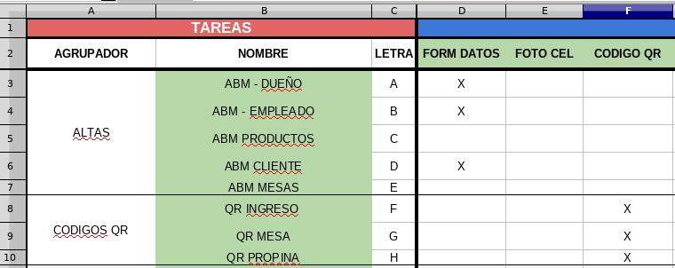
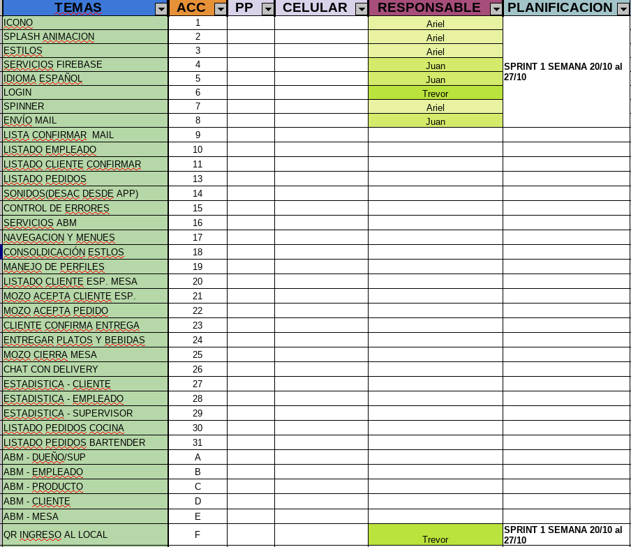

# 2019_TP_PPS_Comanda - Los del fondo.

Estrategia del git utilizada: Merge al master y rebase.
FrontEnd: Ionic
BackEnd: Firebase

Excel: Tareas y Funcionalidades
Link: https://github.com/Hova2/TP_Final_PPS_Mecon/blob/master/PPS19%20-%20Comanda.xlsx

# Sprint 1 20/10 - 27/10

1.- Generación de repositorio  
2.- Creación de estructura general de la aplicacion  
3.- Servicio Firebase  
4.- Login  
5.- Icono  
6.- Splash Screen animado con Logo de la aplicación  
7.- Formulario de entrada de datos y alta de usuarios en Firebase  
8.- Organización interna
9.- Lectura de QR

## Estado Sprint 1
### Funcionalidades

### Tareas

